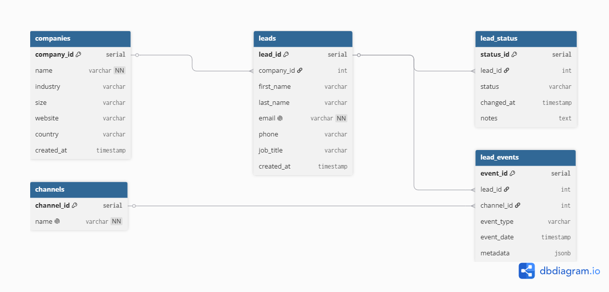
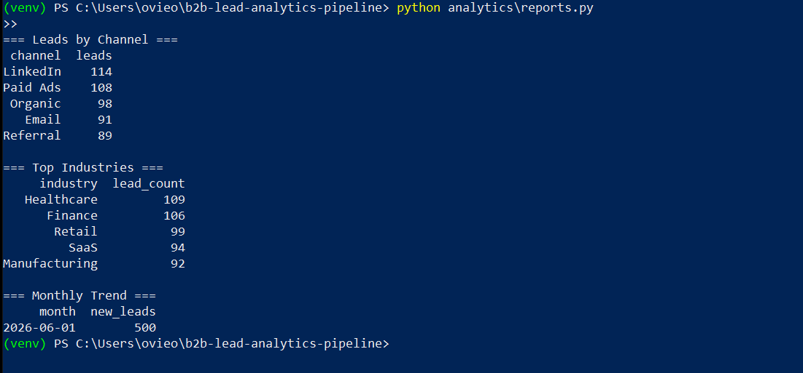
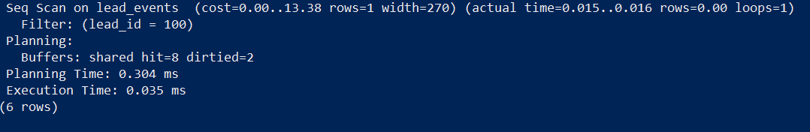
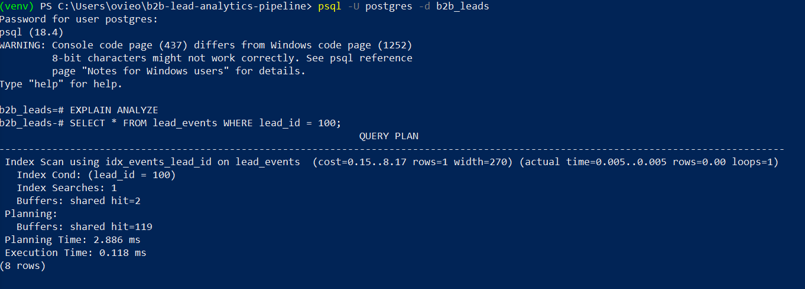

# B2B Lead Analytics Pipeline

A relational lead database and SQL performance analytics pipeline built with PostgreSQL and Python. Designed to ingest, store, and analyze high-volume corporate lead data across multiple acquisition channels.

---

## Overview

This project demonstrates an end-to-end data engineering pipeline; from schema design and ETL scripting to query optimization and real-time reporting. The database is structured in Third Normal Form (3NF) to eliminate redundancy and ensure data integrity across all lead records.

---

## Schema



The schema consists of five normalized tables:

- `companies` — deduplicated company records with industry and size metadata
- `leads` — individual contacts linked to their company via foreign key
- `channels` — acquisition channel reference table (LinkedIn, Email, Organic, etc.)
- `lead_events` — fact table tracking every lead interaction per channel
- `lead_status` — pipeline status history per lead (new, qualified, converted, lost)

---

## Tech Stack

- **Database:** PostgreSQL
- **Language:** Python 3
- **Libraries:** SQLAlchemy, pandas, psycopg2, Faker, python-dotenv

---

## Project Structure

```
b2b-lead-analytics-pipeline/
├── sql/
│   ├── schema.sql        # Table definitions and foreign key constraints
│   ├── indexes.sql       # Performance indexes
│   └── queries.sql       # Analytical queries
├── etl/
│   ├── db.py             # Secure database connection via .env
│   ├── generate_data.py  # Synthetic lead data generator
│   └── load_to_db.py     # ETL pipeline loader
├── analytics/
│   └── reports.py        # Query runner and report output
├── assets/               # Screenshots and diagrams
├── .env                  # Local credentials (not committed)
├── requirements.txt
└── README.md
```

---

## Setup

**1. Clone the repo**
```bash
git clone https://github.com/oviesa/b2b-lead-analytics-pipeline.git
cd b2b-lead-analytics-pipeline
```

**2. Create and activate a virtual environment**
```bash
python -m venv venv
venv\Scripts\activate        # Windows
source venv/bin/activate     # Mac/Linux
```

**3. Install dependencies**
```bash
pip install -r requirements.txt
```

**4. Configure your environment**

Create a `.env` file in the root directory:
```
DB_USER=postgres
DB_PASSWORD=yourpassword
DB_HOST=localhost
DB_NAME=b2b_leads
```

**5. Create the database and run the schema**
```bash
psql -U postgres -c "CREATE DATABASE b2b_leads;"
psql -U postgres -d b2b_leads -f sql/schema.sql
```

**6. Run the ETL pipeline**
```bash
python etl/load_to_db.py
```

**7. Apply indexes**
```bash
psql -U postgres -d b2b_leads -f sql/indexes.sql
```

**8. Run the analytics report**
```bash
python analytics/reports.py
```

---

## Sample Output



```
=== Leads by Channel ===
  channel  leads
 LinkedIn    114
 Paid Ads    108
  Organic     98
    Email     91
 Referral     89

=== Top Industries ===
     industry  lead_count
   Healthcare         109
      Finance         106
       Retail          99
         SaaS          94
Manufacturing          92

=== Monthly Trend ===
      month  new_leads
 2026-06-01        500
```

---

## Query Performance

Indexes were added on all foreign key and high-frequency filter columns. The queries below show the impact of indexing on `lead_events`.

**Before indexing** — full sequential table scan:



**After indexing** — direct index scan, significantly faster execution:



The planner switches from `Seq Scan` (reads every row) to `Index Scan` (jumps directly to matching rows), reducing execution time by an order of magnitude on large datasets.

---

## Key Features

- **3NF normalized schema** with foreign key constraints enforcing referential integrity
- **Secure ETL pipeline** using environment variables for credential management
- **Multi-channel ingestion** parsing lead events across LinkedIn, Email, Organic, Referral, and Paid Ads
- **Analytical SQL queries** using complex joins, aggregations, and window functions
- **Index optimization** with benchmarked before/after performance comparisons

---

## Notes

- The dataset is synthetically generated using the Faker library for demonstration purposes
- `.env` is excluded from version control via `.gitignore`
- All foreign key constraints are enforced at the database level, not just the application layer
